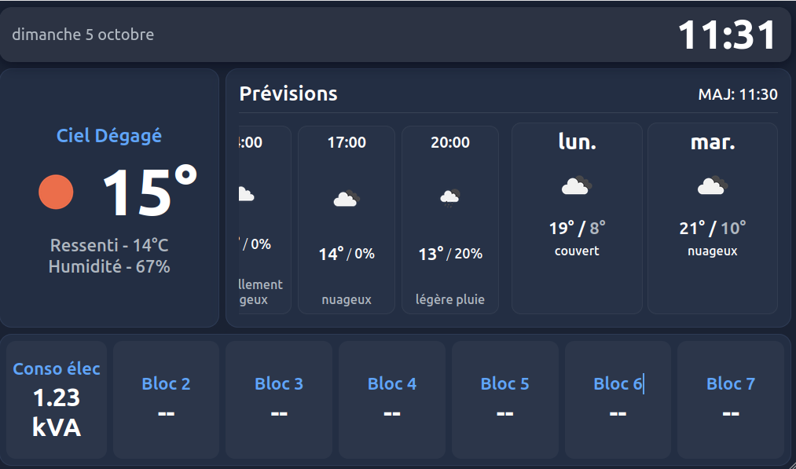

# homelab-iot
Code for ESP and Raspberry Pi devices in the homelab.
To start, clone this Git repository

## HomeDash

A simple display dashboard based on **OpenWeatherMap** and **Prometheus**.

- Shows current weather and hourly / daily forecasts
- Electrical consumption in kVA via Prometheus
- Automatic refresh



Create a file `assets/config.js` with your local configuration, for example:
```js
window.CONFIG = {
  API_KEY: "YOUR_OPENWEATHERMAP_API_KEY",
  CITY: "YOUR_CITY",
  UNITS: "metric",
  LOCALE: "fr",
  PROMETHEUS_URL: 'https://prometheus/api/v1/query?query=linky_tic_standard_sinsts',
  CONSO_REFRESH: 10000,
  WEATHER_REFRESH: 10
};
```

## Setting Up Chromium Kiosk Mode on Raspberry Pi


Your directory should now contain the scripts, for example:

```bash
~/raspberry-pi/kiosk.sh
~/raspberry-pi/kiosk.desktop
```

Make sure the kiosk script is executable

```bash
chmod +x ~/raspberry-pi/kiosk.sh
```

Install required packages

```bash
sudo apt update
sudo apt install -y chromium-browser unclutter x11-xserver-utils
```

Create a symbolic link so the system automatically launches the kiosk script at startup:

```bash
mkdir -p ~/.config/autostart
ln -sf ~/raspberry-pi/kiosk.desktop ~/.config/autostart/kiosk.desktop
```

Reboot to confirm autostart

```bash
sudo reboot
```